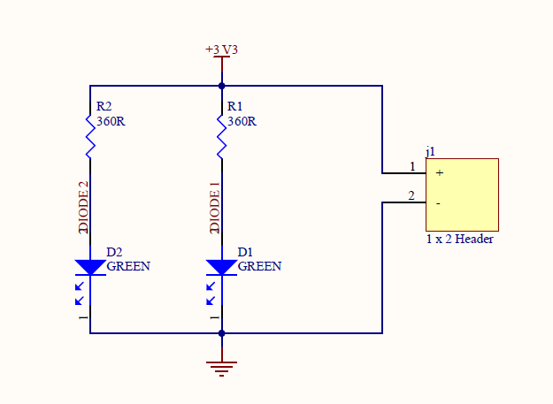

# led-pcb-altium
Custom LED PCB designed using Altium Designer. Includes schematic and PCB layout.

# Simple LED PCB

A **compact single-LED PCB** designed using **Altium Designer**.  
This project serves as a foundational step in understanding schematic creation, layout routing, and basic PCB design principles.

---

## **Features**
- **Single LED** with current-limiting resistor  
- **1x2 male header** for external interfacing  
- **Beginner-friendly** design ideal for prototyping or educational use

---

## **Project Files**
- `SimpleLED.PrjPcb` – **Main project file**  
- `SimpleLED.SchDoc` – **Schematic**  
- `SimpleLED.PcbDoc` – **PCB layout**  

---

## **Tools Used**
- **Altium Designer** (Educational License)

---

## **Preview**

### **Schematic**

### **PCB Layout**

---

## **License**
This project is intended for **educational purposes**.  
Feel free to use and modify it for **non-commercial applications**.

